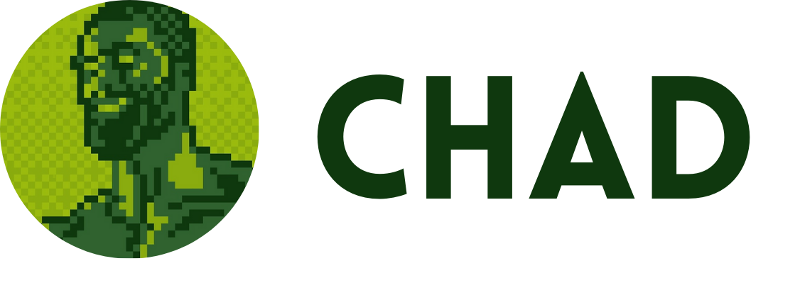

<p align="center">
  
</p>
<h2 align="center">The sequel</h2>

CHAD is a basic message server and GUI built with websockets using C/C++!

More in depth explanation on **how to run**, **multithread model** and **app compilation** are addressed here:

- [**Frontend**](client/README.md)
- [**Backend**](server/README.md)


## Getting Started 🗿

The project dependencies are managed through [Nix](https://nixos.org/download/). Please make sure
to enable [Flakes](https://wiki.nixos.org/wiki/Flakes). To enable flakes you'll
basically need to copy this inside `~/.config/nix/nix.conf` or
`/etc/nix/nix.conf`:

```
experimental-features = nix-command flakes
```

Now, from within the repository root simply type

```bash
# REMEMBER! From within the repository root!
nix develop
```

This will enter you inside a development shell with all the tools that we had
during development.

## Video 🎥

In the follow link you can watch the video where we compile the server and client, we also offer a demo of our client using our server and a server created by another group: [Watch Here](https://youtu.be/tKLMU1hbfx4)
