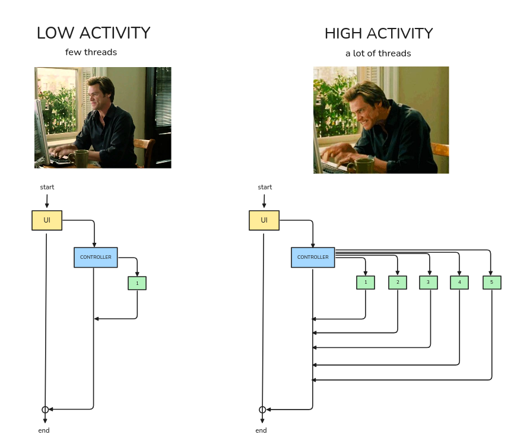
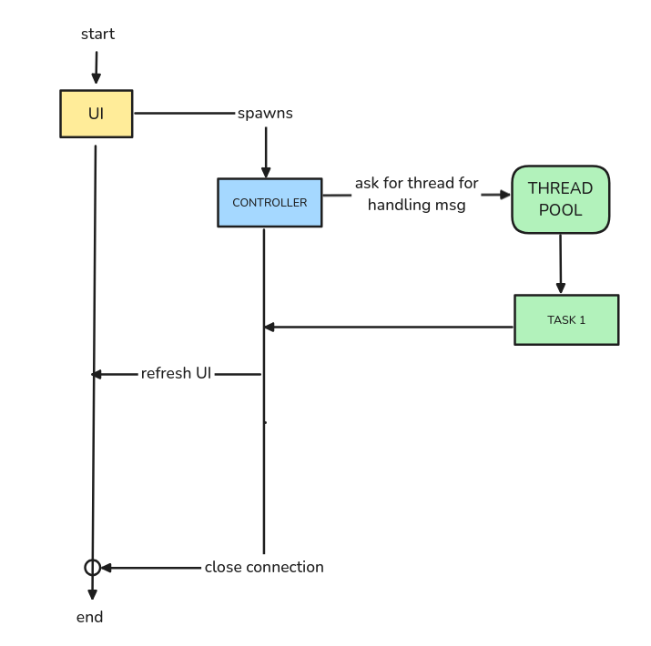

<h1 align="center">GUI Client</h1>

**IMPORTANT!:** The GUI uses Qt for graphic rendering, it can be installed in various forms like [Qt Online installer](https://www.qt.io/download-dev), or your package manager if you are in linux.

## Getting started 🚀


For the client we use [cmake](https://cmake.org/) to compile the client and the UI. All you need to do is create the build directory

```bash
mkdir build
cd build
```

In this directory is where the client is compiled and executable file is generated

**IMPORTANT:** All compilation and execution commans should be done in this `build/` folder.

## Building the project 👷🏿‍♂️


To build the project follow the nexts steps:

```bash
cmake ..
cmake --build .
```
Also instead of using `cmake --build .`, you can use the following command:

```bash
make
```

## Running the project 🏃

With the project built, you can start the GUI with the command:

```bash
# Be sure you are in the build directory or specify it in the command when runnung the project
./chad_ui <username> <connection url>
# Example
./chad_ui chad ws://127.0.0.1:5000/
```

## Multithreading 🧵

The multithreading in the app works somehow like the Lambdas on AWS, or Azure Function in microsoft. **Threads are created and deleted on demand**.

### Why?
A client, unlike a server, doesn't need to be highly available for incoming messages. In practice, especially for personal chats, it's quite rare to receive messages from multiple contacts at the same time — sometimes, you might not hear from someone for months! **Creating an active thread per contact would waste a lot of resources waiting on chats that are mostly inactive**.

Instead, we chose a design where a slight delay of a few milliseconds is acceptable in exchange for significantly lower resource usage. **Threads are created , recycled and destroyed dynamically based on chat activity**, minimizing idle resources that would otherwise sit waiting for incoming messages.



### How it works

On startup, two threads are created and persist until the application closes:

- **GUI Thread**: Manages the application's window rendering.
- **Controller Thread**: Handles incoming connections from the server and spawns task threads to process them.


In addition to these, a thread pool is maintained to manage the threads responsible for processing incoming messages. When the controller creates a new task, the thread pool checks for available threads. If none are free, it creates a new one and recycles it for future tasks. **Threads are freed after 30 seconds of inactivity to avoid excessive resource consumption**.

**Flow:**

1. The app starts and spawns the UI and Controller threads.
2. A message is received, and the Controller spawns a thread to process it.
3. Once the task is completed, the task thread notifies the Controller.
4. The Controller notifies the UI that the Global State has changed, triggering a UI render.





### Yeah yeah, but how does it look in the code

#### Global State
Stores the state of the entire app.

https://github.com/ElrohirGT/CHAD/blob/2c12466a235f8979baee4a4da5ec458b4bdfc2ba/client/client.cpp#L167-L185C1

#### Controller Thread
We are using Qt Thread library, they represent a thread as a class.

https://github.com/ElrohirGT/CHAD/blob/2c12466a235f8979baee4a4da5ec458b4bdfc2ba/client/client.cpp#L596-L606

This is how a message is assigned to a Message Task thread:

https://github.com/ElrohirGT/CHAD/blob/2c12466a235f8979baee4a4da5ec458b4bdfc2ba/client/client.cpp#L644-L666

#### Message Task
Represents a worker which process a single message. The syncronization occurs bye a Mutex at the beginning of thread execution.

https://github.com/ElrohirGT/CHAD/blob/2c12466a235f8979baee4a4da5ec458b4bdfc2ba/client/client.cpp#L299-L313

#### UI handlers

If the UI wants to request something to de server it does so by a function.

https://github.com/ElrohirGT/CHAD/blob/2c12466a235f8979baee4a4da5ec458b4bdfc2ba/client/client.cpp#L745C1-L751C1